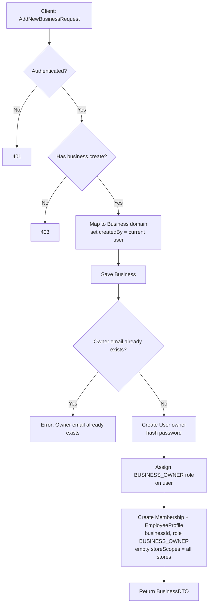
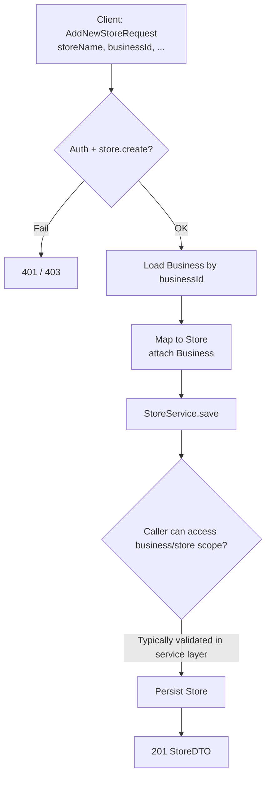
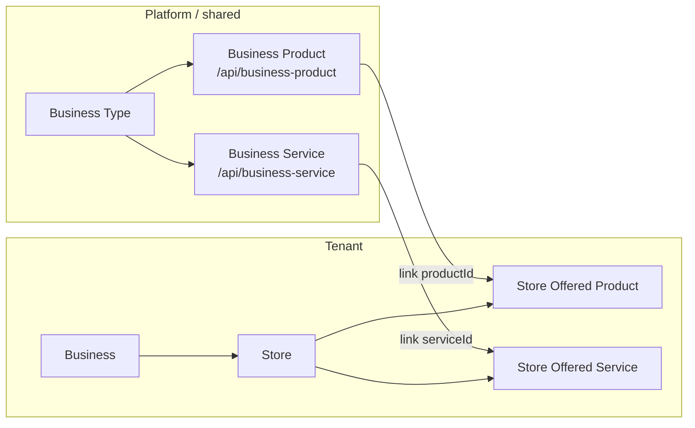
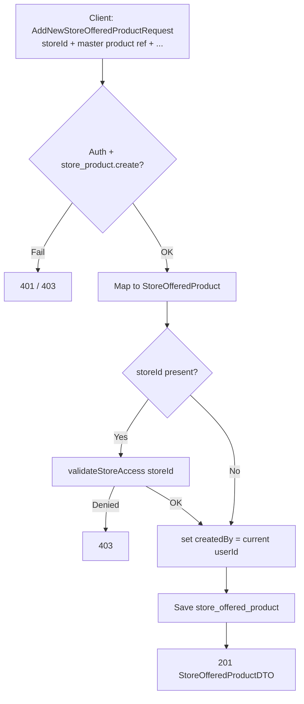
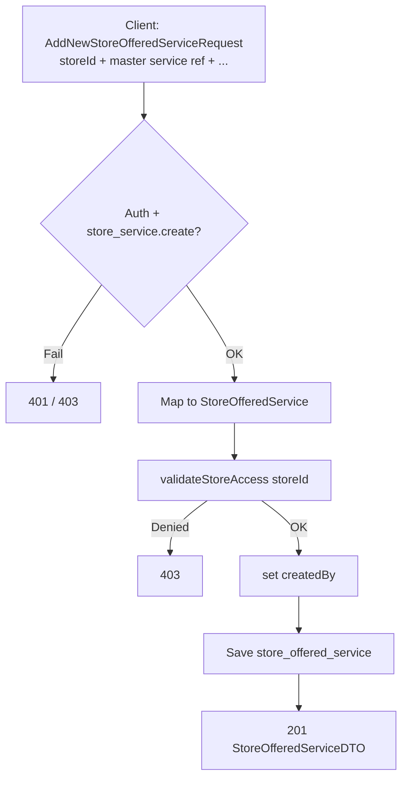
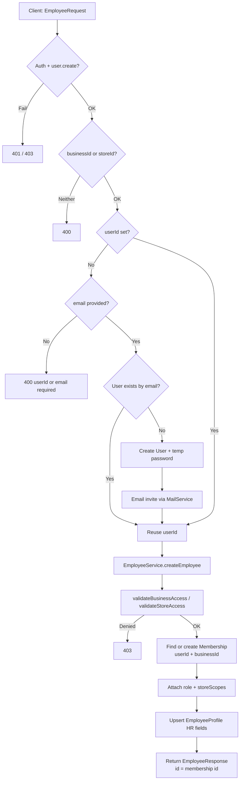
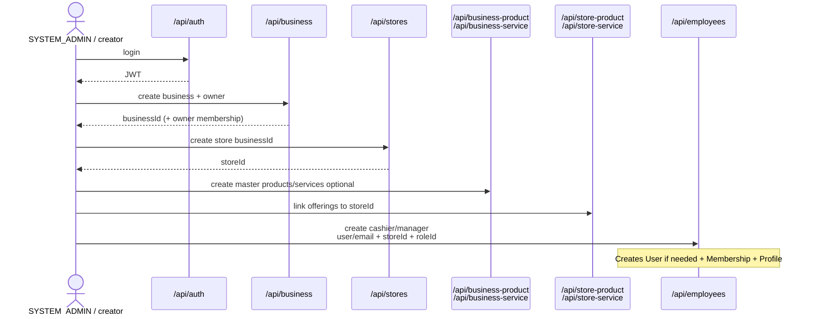

# Core creation flow diagrams

Mermaid flows derived from ClappN controllers/services. Open this file in GitHub / VS Code / Notion for rendered diagrams.

**Common request pipeline (all secured APIs):**

```mermaid
flowchart LR
  A[Client] -->|JWT + optional X-Store-Id / X-Business-Id| B[JwtAuthenticationFilter]
  B --> C[UserScopeFilter<br/>load membership scope from DB]
  C --> D[@RequirePermission]
  D --> E[Controller / Service]
  E -->|403 if out of scope| F[Response]
```

---

## 1. Business creation

`POST /api/business` · permission `business.create`



**Creates:** `business` + `user` (owner) + `membership` (employee API id) + owner profile.

---

## 2. Store creation

`POST /api/stores` · permission `store.create`



**Depends on:** existing `businessId`.  
**After create:** business-scoped users see the new store automatically (empty `storeScopes`); store-scoped users only if that store is added to their membership scopes.

---

## 3. Master catalog → store offerings (big picture)



---

## 4. Store offered product creation

`POST /api/store-product/save` · permission `store_product.create`  
(bulk: `POST /api/store-product/add-all`)



**Prerequisite:** master product usually exists in `/api/business-product`.  
**Scope:** store must be in caller’s accessible stores (or admin).

---

## 5. Store offered service creation

`POST /api/store-service/save` · permission `store_service.create`  
(bulk: `POST /api/store-service/add-all`)



Same pattern as store products.

---

## 6. Employee creation

`POST /api/employees` · permission `user.create`



**Login:** same `POST /api/auth/login` as any user (email + password). No separate employee login.

---

## 7. Recommended onboarding sequence



---

## Quick reference

| Flow | API | Permission | Main tables |
|------|-----|------------|-------------|
| Business | `POST /api/business` | `business.create` | business, user, membership, employee_profile |
| Store | `POST /api/stores` | `store.create` | store |
| Store product | `POST /api/store-product/save` | `store_product.create` | store_offered_product |
| Store service | `POST /api/store-service/save` | `store_service.create` | store_offered_service |
| Employee | `POST /api/employees` | `user.create` | user?, membership, employee_profile |
